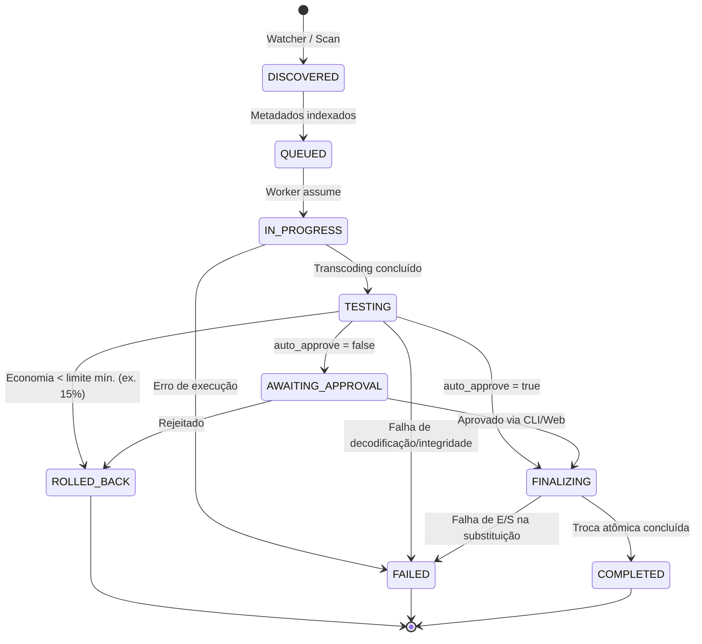

<div align="center">

# CodecAny

<p align="center">
  <strong>Transcoding autônomo e orquestração de mídia em Go — leve, sem Docker e sem servidor monolítico.</strong>
</p>

<p align="center">
  <a href="https://github.com/FM0Ura/codecany/actions/workflows/ci.yml"></a>
  <a href="https://golang.org"></a>
  <a href="https://sqlite.org"></a>
  <a href="https://react.dev"></a>
  <a href="LICENSE"></a>
</p>

<p align="center">
  <a href="#sobre">Sobre</a> •
  <a href="#features">Features</a> •
  <a href="#tech-stack">Tech Stack</a> •
  <a href="#arquitetura">Arquitetura</a> •
  <a href="#requisitos">Requisitos</a> •
  <a href="#instalacao">Instalação</a> •
  <a href="#uso-cli">Uso (CLI)</a> •
  <a href="#painel-de-controle-web">Painel Web</a> •
  <a href="#regras-e-configuracao">Regras</a> •
  <a href="#desenvolvimento">Desenvolvimento</a> •
  <a href="#licenca">Licença</a>
</p>

</div>

---

## Sobre

O **CodecAny** é um sistema modular e autônomo de **transcoding e automação de bibliotecas de mídia** escrito em Go, inspirado conceitualmente no *Tdarr*, porém projetado como um binário nativo estático de baixo consumo de recursos.

Projetado para operar **sem Docker**, **sem JVM/Node em produção** e **sem dependências de runtime pesadas**, o CodecAny pode rodar diretamente no host (bare-metal, NAS, VPS) ou ser embutido como submódulo em arquiteturas maiores. 

O core do orquestrador adota o padrão **Adapter/Strategy** sobre interfaces puras (`MediaProber`, `TranscoderEngine`), persistência em **SQLite com modo WAL** (CGO-free), comunicação por canais nativos do Go e isolamento estrito contra corrupção de arquivos. A **CLI** permanece sendo o cliente canônico e scriptável, enquanto um **painel de controle web opcional** ("Signal Path") fornece visualização em tempo real via Server-Sent Events (SSE).

---

## Features

- 🔍 **Watcher Inteligente com Debounce**: Monitoramento em tempo real via `fsnotify` com temporizador de estabilização de tamanho (`stable-size`), impedindo o processamento de downloads ou gravações incompletas.
- 📋 **Probe com Cache Persistente**: Inspeção completa de streams e metadados com driver padrão `ffprobe` e cache indexado no SQLite.
- ⚙️ **Motor de Regras Declarativas**: Avaliação *first-match wins* (YAML/JSON) com filtros por container, codecs, faixas de resolução (`min_height`/`max_height`), bitrate (`min_bitrate_kbps`) e downscale automático configurável.
- 📦 **Modo Remux-Only**: Suporte a regras de troca atômica de container (ex.: `.avi` / `.mp4` → `.mkv`) com `video.codec: copy` sem re-encodar vídeo.
- 🧠 **Fila Persistente e Concorrência por GPU**: Fila em SQLite WAL imune a quedas de processo, com semáforo dedicado para limitar sessões simultâneas de encoders por hardware (`global.hwaccel_limits` para NVENC, VAAPI, etc.).
- ✅ **Staging com Aprovação Manual**: Suporte a fluxo com aprovação (`auto_approve: false`), mantendo o job em `AWAITING_APPROVAL` com o vídeo convertido isolado em staging para validação antes da substituição.
- 🧪 **Verificação de Integridade & Rollback por Eficiência**: Decodificação ponta a ponta do vídeo gerado antes de qualquer troca física. Aplica rollback automático se a economia de espaço for inferior ao limite definido (default: **15%**).
- 🩺 **Health Check Standalone**: Varredura de integridade da biblioteca sob demanda (CLI ou Web) sem converter nada, ideal para auditar corrupção em acervos existentes.
- 🧹 **Zero-Residue & Boot Recovery**: Limpeza determinística de arquivos temporários (`staging`, `.bak`, `.tmp`). Recuperação transparente no boot para interrupções abruptas (`kill -9`, falta de energia) durante a troca atômica.
- 🛑 **Graceful Shutdown**: Encerramento controlado via `SIGINT`/`SIGTERM` aguardando a finalização da etapa em curso sem corromper arquivos.
- 🖥️ **Painel de Controle Web Embutido**: Interface SPA moderna (React 19 + TypeScript + Vite) embutida via `go:embed`, com monitoramento SSE, editor de regras, navegador de pastas e histórico.

---

## Tech Stack

| Camada | Tecnologias |
|---|---|
| **Backend & Core** | Go 1.26+, SQLite (`modernc.org/sqlite` pure-Go CGO-free), `fsnotify`, `yaml.v3` |
| **Media Processing** | FFmpeg, FFprobe (drivers desacoplados via interface) |
| **Frontend (GUI)** | React 19, TypeScript, Vite 8, React Router 7, Oxlint, CSS Moderno |
| **Gerenciador de Pacotes** | `pnpm` (exclusivo para build do frontend; sem Node em produção) |
| **Build & Tooling** | GNU Make, golangci-lint, GitHub Actions (Quality Gate + Cross-Compile) |

---

## Arquitetura

O projeto divide-se estritamente entre o núcleo orquestrador e os adaptadores de execução:

```
├── cmd/
│   ├── cli/             # Entrypoint da CLI canônica
│   └── server/          # Servidor HTTP/SSE da interface web (serve SPA via go:embed)
├── pkg/
│   ├── core/            # Orquestrador, Watcher, Regras, Fila SQLite, Integridade, Staging
│   └── adapters/
│       └── ffmpeg/      # Implementação concreta das interfaces MediaProber e TranscoderEngine
├── web/                 # SPA do painel de controle (React + TypeScript + Vite)
├── docs/                # Especificação técnica, roadmaps e guias de boas práticas
└── rules.example.yaml   # Arquivo de exemplo com regras comentadas
```

### Ciclo de Vida do Job



> [!NOTE]
> Toda substituição de arquivo no disco (`TESTING` → `FINALIZING`) só ocorre após a decodificação completa do arquivo de saída em diretório temporário (`staging_dir`). Se o processo for interrompido abruptamente, a rotina `recoverStuckFinalization` restaura o estado seguro no boot subsequente.

---

## Requisitos

- **Runtime de Execução**:
  - Binário compilado do CodecAny (Linux, macOS ou Windows).
  - `ffmpeg` e `ffprobe` instalados e acessíveis no `$PATH`.
- **Ambiente de Compilação (Opcional)**:
  - Go **1.26+**
  - **pnpm** (necessário somente para compilar os assets do painel web; o binário final não depende de Node.js).

---

## Instalação

### Compilando via Make (Recomendado)

```bash
# Compilar apenas o binário CLI
make build

# Compilar o servidor com o painel de controle embutido
make gui-build

# Compilar ambos (CLI + Server)
make build-all
```

### Compilando Manualmente com a Toolchain Go

```bash
# CLI
go build -o codecany ./cmd/cli

# Servidor Web (requer compilação prévia do frontend para cmd/server/webdist)
cd web && pnpm install && pnpm build && cd ..
go build -o codecany-server ./cmd/server
```

---

## Uso (CLI)

O CodecAny pode operar como daemon contínuo monitorando pastas, processar arquivos pontuais em lote, auditar integridade ou gerenciar o fluxo de aprovação de staging.

```bash
# 1. Modo Daemon contínuo com monitoramento de diretórios
./codecany -db codecany.db -rules rules.yaml -workers 2 -dir /mnt/filmes -dir /mnt/series

# 2. Processamento único de arquivos específicos (one-shot)
./codecany -rules rules.yaml -file /mnt/media/video1.mkv -file /mnt/media/video2.mp4

# 3. Listar jobs aguardando aprovação manual (quando auto_approve: false)
./codecany -db codecany.db -list-staged

# 4. Aprovar ou rejeitar jobs em staging
./codecany -db codecany.db -approve <job-id>
./codecany -db codecany.db -reject <job-id>
./codecany -db codecany.db -approve-all
./codecany -db codecany.db -reject-all

# 5. Consultar histórico com filtros
./codecany -db codecany.db -history -status COMPLETED -since 24h

# 6. Varredura de integridade (Health Check sem conversão)
./codecany -health-check -dir /mnt/media
```

### Tabela de Parâmetros da CLI

| Categoria | Flag | Padrão | Descrição |
|---|---|---|---|
| **Operação** | `-db` | `codecany.db` | Caminho do arquivo SQLite (modo WAL). |
| | `-rules` | `rules.yaml` | Caminho do arquivo de regras YAML/JSON. |
| | `-workers` | `1` | Quantidade de workers paralelos. |
| | `-dir` | — | Diretório a ser monitorado/escaneado (repetível). |
| | `-file` | — | Arquivo pontual para processamento one-shot (repetível). |
| | `-scan-interval` | `1m` | Intervalo da varredura periódica de fallback (`0` desativa). |
| **Logs** | `-json` | `false` | Emite logs estruturados em JSON para stdout. |
| | `-log-dir` | `logs` | Diretório de persistência dos arquivos de log. |
| | `-log-level` | `info` | Nível de log (`debug`, `info`, `warn`, `error`). |
| **Staging** | `-list-staged` | — | Lista todos os jobs em `AWAITING_APPROVAL`. |
| | `-approve <id>` | — | Aprova um job específico e comita a troca atômica. |
| | `-approve-all` | — | Aprova todos os jobs em staging. |
| | `-reject <id>` | — | Rejeita o job, purga o staging e preserva o original. |
| | `-reject-all` | — | Rejeita todos os jobs em staging. |
| **Auditoria** | `-history` | — | Consulta o histórico de jobs persistido no banco. |
| | `-status` | — | Filtro de status para `-history` (`COMPLETED`, `FAILED`, etc.). |
| | `-since` | — | Janela temporal para histórico (ex.: `24h`, `30m`). |
| | `-health-check`| — | Executa auditoria de integridade da mídia sem converter. |

---

## Painel de Controle Web

O CodecAny possui um painel de controle opcional embutido no binário `codecany-server`, sem necessidade de servidores Node ou containers adicionais em produção.

```bash
./codecany-server -db codecany.db -rules rules.yaml -addr 127.0.0.1:8383 -dir /mnt/media
```

Acesse via navegador em `http://127.0.0.1:8383`.

### Módulos do Painel

1. **Dashboard**: Métricas consolidadas, contadores por status, economia total de disco, uso de sessões hwaccel e monitoramento em tempo real via SSE.
2. **Fila de Execução**: Listagem detalhada com filtros de estado, taxa de compressão e drawer de inspeção individual.
3. **Aguardando Aprovação**: Painel de staging com comparação visual e ações de aprovação/rejeição individuais ou em lote.
4. **Diretórios Monitorados**: Gerenciamento dinâmico de caminhos monitorados com navegador de arquivos e re-varredura sob demanda.
5. **Builder de Regras**: Editor visual interativo com reordenação *drag-and-drop*, simulador de correspondência e recarregamento a quente (*hot-reload*).
6. **Health Check**: Diagnóstico de integridade sob demanda escopado por diretório.
7. **Histórico**: Registro analítico de processamentos e gráfico de economia por período.

### Acesso Remoto Seguro com Tailscale

Por padrão e segurança, o servidor faz bind local (`127.0.0.1`). Para acessá-lo remotamente em outros dispositivos da sua rede privada de forma segura:

```bash
# Expor via Tailscale com HTTPS automático (porta 8443)
tailscale serve --bg --https 8443 http://127.0.0.1:8383

# Para desativar quando não estiver usando:
tailscale serve --https 8443 off
```

---

## Regras e Configuração

As regras determinam o comportamento da conversão e são avaliadas na ordem em que aparecem (**primeira correspondência vence**).

Consulte o arquivo [`rules.example.yaml`](rules.example.yaml) para a referência completa.

```yaml
version: 1

global:
  default_driver: ffmpeg
  staging_dir: .codecany_tmp/
  
  # Rollback automático se o arquivo convertido economizar menos de 15%
  space_saving:
    min_saving_pct: 15
    fallback_action: rollback

  # Limite de sessões simultâneas de hardware encoder
  hwaccel_limits:
    nvenc: 2
    vaapi: 1

  defaults:
    video:
      codec: av1
      crf: 28
      preset: 5
    audio:
      codec: flac
    container: auto
    auto_approve: false # Exige aprovação manual antes da substituição

rules:
  # 1. Regra específica: Remux H264 de alto bitrate para AV1
  - name: "MKV H264 Remux -> AV1"
    match:
      container: mkv
      video:
        codec: h264
        min_bitrate_kbps: 15000
    convert:
      video:
        codec: av1
        crf: 28
      audio:
        codec: copy
      container: mkv

  # 2. Regra de exclusão: Não processar arquivos que já estão em AV1
  - name: "Pular AV1 existente"
    match:
      video:
        codec: av1
    action: skip

ignore:
  dir_contains: ["backup", "downloads_incompletos"]
  file_suffix: [".part", ".crdownload", ".tmp"]
  min_size_bytes: 1048576 # Ignora arquivos menores que 1MB
```

---

## Desenvolvimento

### Comandos de Teste e Qualidade

O projeto inclui targets dedicados no [Makefile](Makefile):

```bash
# Executar testes unitários (utilizando mocks)
make test
# Ou diretamente: go test ./... -count=1

# Executar análise estática de código Go
make lint

# Formatar código Go
make fmt

# Desenvolvimento do frontend com Hot-Reload (Vite)
make gui-dev
```

### CI/CD Pipeline

O repositório possui integração contínua configurada via [GitHub Actions](.github/workflows/ci.yml):
- **Quality Gate (Go)**: `gofmt`, `go vet`, `golangci-lint` e testes unitários.
- **Quality Gate (Frontend)**: `oxlint`, typecheck (`tsc`) e validação de sincronia do diretório `cmd/server/webdist`.
- **Cross-Compile**: Compilação automatizada de binários estáticos para Linux (`amd64`, `arm64`), macOS (`amd64`, `arm64`) e Windows (`amd64`).
- **Release SemVer**: Publicação automática de artefatos anexados a tags de release `v*`.

---

## Licença

Este projeto é distribuído sob a licença [MIT](LICENSE).

