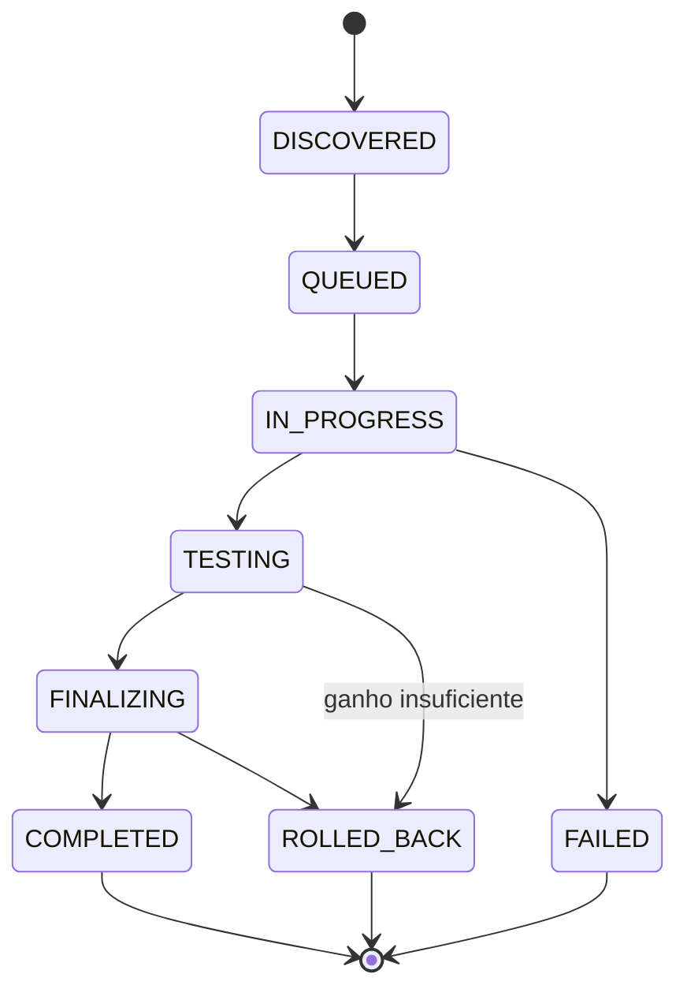

# CodecAny

<p align="center">
  Transcoding autônomo de mídia para Go, sem Docker e sem servidor web monolítico.
</p>

<p align="center">
  <a href="#sobre">Sobre</a> •
  <a href="#features">Features</a> •
  <a href="#requisitos">Requisitos</a> •
  <a href="#instalacao">Instalação</a> •
  <a href="#uso">Uso</a> •
  <a href="#regras">Regras</a> •
  <a href="#arquitetura">Arquitetura</a> •
  <a href="#desenvolvimento">Desenvolvimento</a>
</p>

---

## Sobre

Sistema modular e autônomo de **transcoding de mídia** para Go, inspirado no *Tdarr*. É um binário estático nativo de baixo footprint que orquestra e converte vídeos **sem Docker**, **sem servidor web monolítico** e **sem runtime pesado** — ideal para operar em um host ou ser embutido como submódulo reutilizável em um ecossistema maior.

O projeto segue uma arquitetura orientada a eventos com o padrão **Adapter/Strategy**, banco de dados embutido em arquivo único (SQLite WAL) e comunicação por canais internos nativos. O core interage apenas com interfaces puras, permitindo drivers de encoder alternativos sem tocar no orquestrador.

## Features

- 🔍 **Watcher com debounce** — monitora diretórios via `fsnotify` com timer de estabilização de tamanho (`stable-size`) para evitar enfileirar arquivos em gravação/download.
- 📋 **Probe pluggable** — inspeção de metadados via interface `MediaProber` (driver padrão `ffprobe`) com cache no SQLite.
- ⚙️ **Regras declarativas** — avaliação *first-match wins* sobre regras YAML/JSON com `match` por igualdade escalar ou lista OR.
- 🧠 **Fila persistente** — enfileiramento e priorização no SQLite (modo WAL), gerenciado por workers com canais nativos.
- 🧪 **Integridade + economia de espaço** — valida contêiner e compara tamanho original × convertido; aplica **rollback** se o ganho for abaixo do limite (default **15%**).
- 🧹 **Zero-residue** — purga automática de arquivos temporários (`staging`, `.bak`, `.tmp`) com recuperação de órfãos no boot.
- 🛑 **Graceful shutdown** — `SIGINT`/`SIGTERM` abortam jobs e purgam resíduos com segurança.

## Requisitos

- Go **1.26+** (ou apenas o binário compilado)
- `ffmpeg` e `ffprobe` no `PATH` (para o driver padrão)

## Instalação

```bash
go build -o codecany ./cmd/cli
```

O binário é estático e não exige dependências de runtime além dos binários `ffmpeg`/`ffprobe`.

## Uso

```bash
./codecany -db codecany.db -rules examples/rules.yaml -workers 1 -dir /mnt/media

# múltiplos diretórios
./codecany -dir /mnt/filmes -dir /mnt/series

# processar arquivo(s) específico(s) uma vez e sair
./codecany -file /mnt/media/arquivo.mkv -file /mnt/media/outro.mkv

# log estruturado JSON
./codecany -json -dir /mnt/media
```

### Flags

| Flag | Default | Descrição |
|---|---|---|
| `-db` | `codecany.db` | arquivo SQLite (WAL) |
| `-rules` | `rules.yaml` | arquivo de regras YAML/JSON |
| `-workers` | `1` | número de workers |
| `-dir` | — | diretório a monitorar (repetível) |
| `-file` | — | arquivo específico a processar uma vez e sair (repetível; substitui o modo watch) |
| `-json` | `false` | log estruturado em JSON |

## Painel de controle (opcional)

Além do binário CLI, há um servidor web opcional (`cmd/server`) que expõe um painel de controle (dashboard, fila, aprovação, regras etc. — ver [`docs/propostas_painel_controle.md`](docs/propostas_painel_controle.md)). Consome o mesmo `pkg/core` que o `cmd/cli`, sem nenhuma mudança na filosofia "binário estático, sem servidor pesado": o painel é só mais um cliente das interfaces já existentes.

```bash
# build do frontend (gera cmd/server/webdist, embutido no binário via go:embed)
cd web && pnpm install && pnpm build && cd ..

# build + execução do servidor (mesmas flags do cmd/cli, mais -addr)
go build -o codecany-server ./cmd/server
./codecany-server -db codecany.db -rules rules.yaml -addr 127.0.0.1:8383 -dir /mnt/media
```

Acesse `http://127.0.0.1:8383`. Sem autenticação — assume rede confiável (bind padrão em `127.0.0.1`). Requer **pnpm** (não npm/yarn) só em tempo de build do frontend; o binário final não depende de Node em produção.

### Acesso remoto via Tailscale

O servidor continua bindado só em `127.0.0.1` (nunca exposto por engano em nenhuma interface de rede) — quem expõe pra sua tailnet é o próprio Tailscale, via `tailscale serve`:

```bash
tailscale serve --bg --https 8443 http://127.0.0.1:8383
```

Fica acessível em `https://<nome-da-máquina>.<sua-tailnet>.ts.net:8443`, com HTTPS automático, a partir de qualquer dispositivo autorizado na tailnet — sem precisar mudar o `-addr` do `codecany-server` nem abrir porta nenhuma. Para desligar: `tailscale serve --https 8443 off`.

## Regras (`rules.yaml`)

Veja o exemplo completo em [`examples/rules.yaml`](examples/rules.yaml). Resumo:

- **First-match wins** — a primeira regra que casar vence; regras específicas devem vir antes das genéricas.
- **`match`** por igualdade escalar (`codec: h264`) ou lista OR (`codec: [aac, ac3]`).
- **Áudio não é impeditivo** — codecs de áudio divergentes não bloqueiam a conversão de vídeo; o `convert.audio` define a saída (habitualmente `copy`, sem perda).
- **`action: skip`** define regras de "não converter".
- **`global.space_saving.min_saving_pct`** define o limite de rollback (default **15%**).
- **`ignore`** permite pular caminhos, sufixos e arquivos abaixo de um tamanho mínimo.

## Arquitetura

```
/pkg/core              → orquestrador, watcher com debounce, fila SQLite (WAL), regras, integridade, cleanup
/pkg/adapters/ffmpeg   → driver padrão (ffprobe + ffmpeg)
/cmd/cli               → wrapper de linha de comando
/cmd/server            → servidor HTTP do painel de controle (REST + SSE), serve o SPA de /web embutido via go:embed
/web                   → frontend do painel (React + TypeScript + Vite, gerenciado só com pnpm)
```

O core se comunica somente através das interfaces puras `MediaProber` e `TranscoderEngine`, permitindo drivers alternativos sem alterações no orquestrador.

Ciclo de vida do job:



## Desenvolvimento

```bash
go test ./... -count=1                # unitários (mocks, sem ffmpeg)
go test -tags integration ./...        # integração (requer ffmpeg)
gofmt -l .
go vet ./...
```

CI (GitHub Actions): quality gate → cross-compile (linux/macos/windows) → release SemVer.

## Licença

MIT
