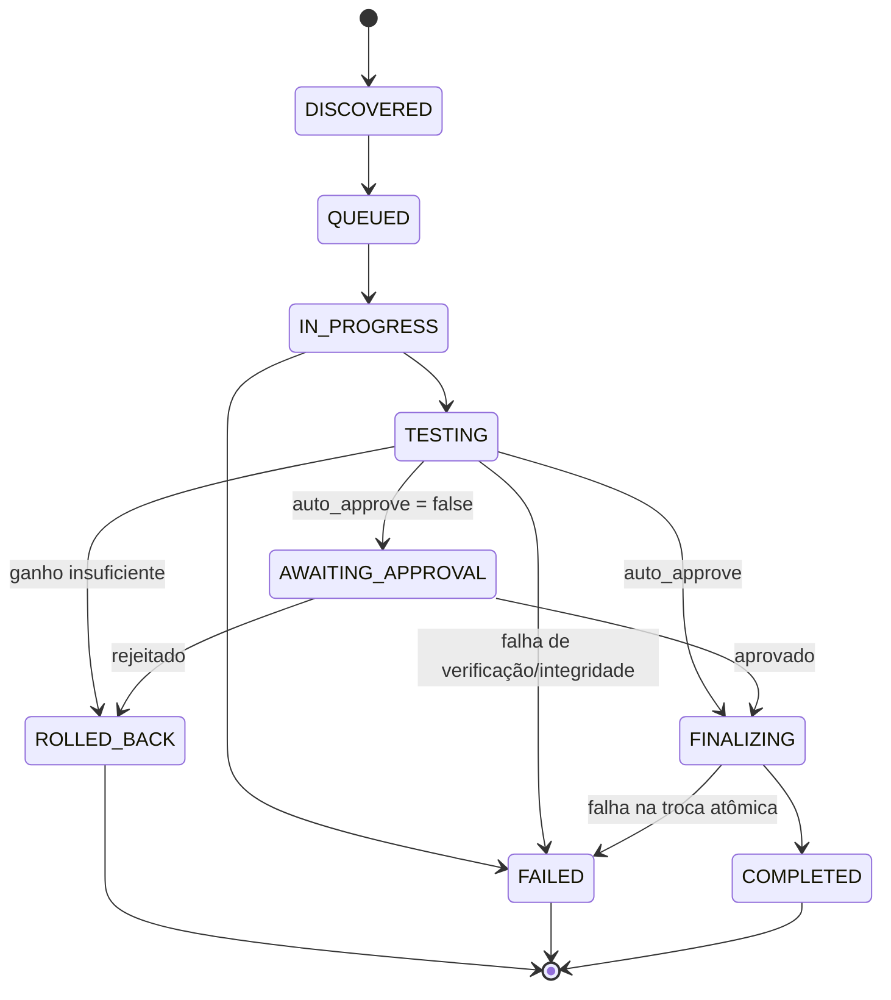

# CodecAny

<p align="center">
  Transcoding autônomo de mídia para Go, sem Docker e sem servidor web monolítico.
</p>

<p align="center">
  <a href="#sobre">Sobre</a> •
  <a href="#features">Features</a> •
  <a href="#requisitos">Requisitos</a> •
  <a href="#instalacao">Instalação</a> •
  <a href="#uso">Uso</a> •
  <a href="#regras">Regras</a> •
  <a href="#painel-de-controle-opcional">Painel de Controle</a> •
  <a href="#arquitetura">Arquitetura</a> •
  <a href="#desenvolvimento">Desenvolvimento</a>
</p>

---

## Sobre

Sistema modular e autônomo de **transcoding de mídia** para Go, inspirado no *Tdarr*. É um binário estático nativo de baixo footprint que orquestra e converte vídeos **sem Docker**, **sem servidor web monolítico** e **sem runtime pesado** — ideal para operar em um host ou ser embutido como submódulo reutilizável em um ecossistema maior.

O projeto segue uma arquitetura orientada a eventos com o padrão **Adapter/Strategy**, banco de dados embutido em arquivo único (SQLite WAL) e comunicação por canais internos nativos. O core interage apenas com interfaces puras, permitindo drivers de encoder alternativos sem tocar no orquestrador. Um [painel de controle web opcional](#painel-de-controle-opcional) consome exatamente as mesmas interfaces — a CLI continua sendo o modo de operação canônico, "sem cabeça"/scriptável.

## Features

- 🔍 **Watcher com debounce** — monitora diretórios via `fsnotify` com timer de estabilização de tamanho (`stable-size`) para evitar enfileirar arquivos em gravação/download.
- 📋 **Probe pluggable** — inspeção de metadados via interface `MediaProber` (driver padrão `ffprobe`) com cache no SQLite.
- ⚙️ **Regras declarativas** — avaliação *first-match wins* sobre regras YAML/JSON com `match` por igualdade escalar ou lista OR, além de faixas de altura/bitrate de vídeo (com downscale opcional via `-vf scale`).
- 📦 **Remux-only** — regras com `video.codec: copy` trocam só o container (ex.: `.avi` → `.mkv`) sem recodificar vídeo.
- 🧠 **Fila persistente** — enfileiramento e priorização no SQLite (modo WAL), gerenciado por workers com canais nativos.
- 🎮 **Limite de concorrência por hwaccel** — semáforo por vendor de GPU (`global.hwaccel_limits`) evita estourar sessões simultâneas de encoders físicos (ex.: NVENC).
- ✅ **Staging com aprovação manual** — quando `auto_approve: false`, o job pausa em `AWAITING_APPROVAL` com o output validado em staging; aprovar/rejeitar via CLI (`-list-staged`, `-approve`, `-reject`) ou pelo [painel de controle](#painel-de-controle-opcional).
- 🧪 **Integridade + economia de espaço** — decodifica o output de ponta a ponta antes de qualquer troca e compara tamanho original × convertido; aplica **rollback** se o ganho for abaixo do limite (default **15%**).
- 🩺 **Health check standalone** — varredura de integridade da biblioteca sem transcodificar nada (`-health-check` na CLI, ou sob demanda pelo painel), útil para auditar corrupção em bibliotecas grandes.
- 🧹 **Zero-residue** — purga automática de arquivos temporários (`staging`, `.bak`, `.tmp`); recuperação automática no boot de jobs presos por interrupção dura (`kill -9`, queda de energia) durante a troca atômica do arquivo — o original nunca é perdido.
- 🛑 **Graceful shutdown** — `SIGINT`/`SIGTERM` esperam o job em curso terminar sua etapa em segurança (nunca cortam uma troca de arquivo no meio) antes de encerrar.
- 🖥️ **Painel de controle web (opcional)** — dashboard, fila, aprovação, diretórios monitorados, builder de regras, health check e histórico. Ver [seção dedicada](#painel-de-controle-opcional).

## Requisitos

- Go **1.26+** (ou apenas o binário compilado)
- `ffmpeg` e `ffprobe` no `PATH` (para o driver padrão)
- **pnpm** — só se for buildar o [painel de controle](#painel-de-controle-opcional) a partir do código-fonte (o binário final não depende de Node em produção)

## Instalação

```bash
go build -o codecany ./cmd/cli
# ou: make build
```

O binário é estático e não exige dependências de runtime além dos binários `ffmpeg`/`ffprobe`.

## Uso

```bash
./codecany -db codecany.db -rules rules.example.yaml -workers 1 -dir /mnt/media

# múltiplos diretórios
./codecany -dir /mnt/filmes -dir /mnt/series

# processar arquivo(s) específico(s) uma vez e sair
./codecany -file /mnt/media/arquivo.mkv -file /mnt/media/outro.mkv

# log estruturado JSON
./codecany -json -dir /mnt/media

# listar jobs aguardando aprovação manual (auto_approve: false) e sair
./codecany -db codecany.db -list-staged

# aprovar/rejeitar um job específico (ou todos de uma vez)
./codecany -db codecany.db -approve <job-id>
./codecany -db codecany.db -reject-all

# histórico filtrável, sem transcodificar nada
./codecany -db codecany.db -history -status FAILED -since 24h

# varredura de integridade sem transcodificar (health check standalone)
./codecany -health-check -dir /mnt/media
```

### Flags

**Núcleo**

| Flag | Default | Descrição |
|---|---|---|
| `-db` | `codecany.db` | arquivo SQLite (WAL) |
| `-rules` | `rules.yaml` | arquivo de regras YAML/JSON |
| `-workers` | `1` | número de workers |
| `-dir` | — | diretório a monitorar (repetível) |
| `-file` | — | arquivo específico a processar uma vez e sair (repetível; substitui o modo watch) |
| `-scan-interval` | `1m` | intervalo da varredura periódica de fallback (`0` desliga) |

**Logging**

| Flag | Default | Descrição |
|---|---|---|
| `-json` | `false` | log estruturado em JSON |
| `-log-dir` | `logs` | pasta dos arquivos de log |
| `-log-level` | `info` | nível de log (`debug`\|`info`\|`warn`\|`error`) |

**Aprovação manual (staging)** — jobs com `auto_approve: false` pausam em `AWAITING_APPROVAL`

| Flag | Descrição |
|---|---|
| `-list-staged` | lista jobs aguardando aprovação e sai |
| `-approve <id>` | aprova o job informado (comita o output) e sai |
| `-approve-all` | aprova todos os jobs aguardando aprovação e sai |
| `-reject <id>` | rejeita o job informado (descarta o output, preserva o original) e sai |
| `-reject-all` | rejeita todos os jobs aguardando aprovação e sai |

**Histórico**

| Flag | Descrição |
|---|---|
| `-history` | lista o histórico de jobs (combine com `-status`/`-since`) e sai |
| `-status` | filtra `-history` por status (ex.: `COMPLETED`, `FAILED`) |
| `-since` | filtra `-history` por janela de tempo (ex.: `24h`, `30m`) |

**Health check**

| Flag | Descrição |
|---|---|
| `-health-check` | varre `-dir`/`-file` em busca de arquivos corrompidos (sem transcodificar) e sai |

## Regras (`rules.yaml`)

Veja o exemplo completo em [`rules.example.yaml`](rules.example.yaml). Resumo:

- **First-match wins** — a primeira regra que casar vence; regras específicas devem vir antes das genéricas.
- **`match`** por igualdade escalar (`codec: h264`) ou lista OR (`codec: [aac, ac3]`), além de `video.min_height`/`max_height`/`min_bitrate_kbps` para regras por resolução/bitrate.
- **Áudio não é impeditivo** — codecs de áudio divergentes não bloqueiam a conversão de vídeo; o `convert.audio` define a saída (habitualmente `copy`, sem perda).
- **`action: skip`** define regras de "não converter"; `convert.video.codec: copy` define remux-only (troca só o container).
- **`convert.video.max_height`** aplica downscale opcional (`-vf scale`) quando a altura de origem for maior.
- **`auto_approve`** (por regra, com fallback nos `defaults` globais) — `false` pausa o job em `AWAITING_APPROVAL` em vez de commitar automaticamente.
- **`global.space_saving.min_saving_pct`** define o limite de rollback (default **15%**).
- **`global.hwaccel_limits`** limita sessões simultâneas de hwaccel por vendor (ex.: `nvenc: 2`).
- **`ignore`** permite pular caminhos, sufixos e arquivos abaixo de um tamanho mínimo.

## Painel de controle (opcional)

Além do binário CLI, há um servidor web opcional (`cmd/server`) que expõe um painel de controle completo — consome o mesmo `pkg/core` que o `cmd/cli`, pelas mesmas interfaces puras, sem nenhuma mudança na filosofia "binário estático, sem servidor pesado": o painel é só mais um cliente. Identidade visual e plano completo em [`docs/design_painel_controle.md`](docs/design_painel_controle.md) e [`docs/propostas_painel_controle.md`](docs/propostas_painel_controle.md) ("Signal Path" — paleta preto/roxo/cyano).

Sete telas, todas funcionais:

| Tela | O que faz |
|---|---|
| **Dashboard** | contadores por status, economia acumulada, utilização de hwaccel, progresso ao vivo (SSE) |
| **Fila** | todos os jobs com filtro por status, tamanho original/convertido, drawer de detalhe |
| **Aguardando Aprovação** | staging — aprovar/rejeitar individual ou em lote (com confirmação) |
| **Diretórios Monitorados** | listar/adicionar/remover diretórios persistidos, navegador de filesystem, rescan manual |
| **Regras** | builder completo (match, convert, auto_approve, enable/disable, reorder), testador de regras, hot-reload |
| **Health Check** | verificação de integridade sob demanda, com escopo por diretório monitorado |
| **Histórico** | jobs filtráveis por status/período, gráfico de economia por dia |

### Build & execução

Via `make` (recomendado — `make help` mostra todos os alvos, incluindo os de GUI):

```bash
make gui-build   # builda o frontend (pnpm) + o binário Go com os estáticos embutidos
make gui-run ARGS="-dir /mnt/media"

# desenvolvimento com hot-reload (roda em paralelo a um `make gui-run`)
make gui-dev
```

Equivalente manual:

```bash
cd web && pnpm install && pnpm build && cd ..    # gera cmd/server/webdist, embutido via go:embed
go build -o codecany-server ./cmd/server
./codecany-server -db codecany.db -rules rules.yaml -addr 127.0.0.1:8383 -dir /mnt/media
```

Acesse `http://127.0.0.1:8383`. Sem autenticação — assume rede confiável (bind padrão em `127.0.0.1`). Requer **pnpm** (não npm/yarn) só em tempo de build do frontend; o binário final não depende de Node em produção.

### Acesso remoto via Tailscale

O servidor continua bindado só em `127.0.0.1` (nunca exposto por engano em nenhuma interface de rede) — quem expõe pra sua tailnet é o próprio Tailscale, via `tailscale serve`:

```bash
tailscale serve --bg --https 8443 http://127.0.0.1:8383
```

Fica acessível em `https://<nome-da-máquina>.<sua-tailnet>.ts.net:8443`, com HTTPS automático, a partir de qualquer dispositivo autorizado na tailnet — sem precisar mudar o `-addr` do `codecany-server` nem abrir porta nenhuma. Para desligar: `tailscale serve --https 8443 off`.

Alternativa mais simples (sem HTTPS, sem processo extra): bindar direto na interface do Tailscale — `./codecany-server -addr $(tailscale ip -4):8383 ...` e acessar por `http://<hostname-magicdns>:8383`.

## Arquitetura

```
/pkg/core              → orquestrador, watcher com debounce, fila SQLite (WAL), regras, integridade, cleanup, health check
/pkg/adapters/ffmpeg   → driver padrão (ffprobe + ffmpeg)
/cmd/cli               → wrapper de linha de comando
/cmd/server            → servidor HTTP do painel de controle (REST + SSE), serve o SPA de /web embutido via go:embed
/web                   → frontend do painel (React + TypeScript + Vite, gerenciado só com pnpm)
```

O core se comunica somente através das interfaces puras `MediaProber` e `TranscoderEngine`, permitindo drivers alternativos sem alterações no orquestrador.

Ciclo de vida do job:



Toda troca de arquivo (`TESTING`→`FINALIZING`) já passou por uma decodificação completa do output antes de substituir o original. Uma interrupção dura (`kill -9`, queda de energia) exatamente durante a troca atômica é detectada e resolvida com segurança no próximo boot — o job é liberado para reprocessamento e o arquivo original nunca fica "perdido" (ver `Engine.recoverStuckFinalization` em `pkg/core/engine.go`). Um `Ctrl+C`/`SIGTERM` único é sempre seguro: o shutdown gracioso espera a etapa em curso terminar antes de encerrar o processo.

## Desenvolvimento

```bash
go test ./... -count=1                # unitários (mocks, sem ffmpeg)
go test -tags integration ./...        # integração (requer ffmpeg)
gofmt -l .
go vet ./...
```

Ou via `make` (`make help` lista todos os alvos, com build/run tanto da CLI quanto do painel): `make test`, `make lint`, `make fmt`, `make build-all` (CLI + GUI).

CI (GitHub Actions): quality gate → cross-compile (linux/macos/windows) → release SemVer.

## Licença

MIT
