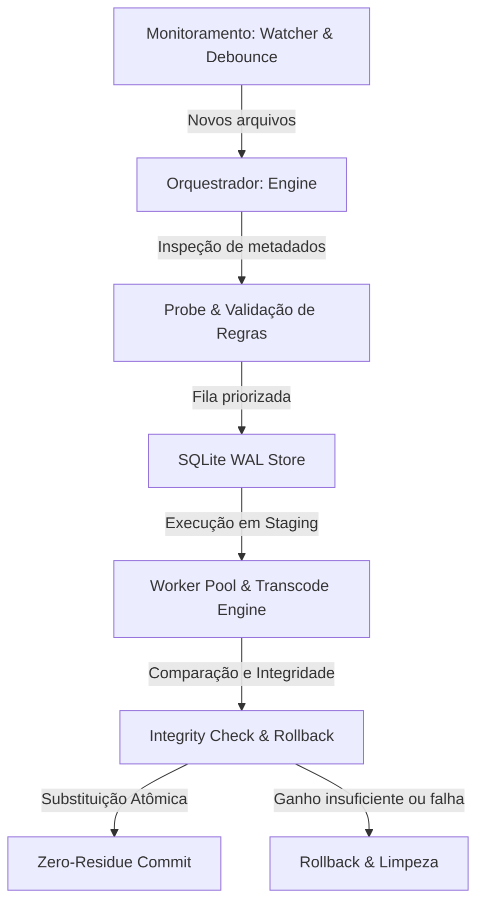

# CodecAny — Roadmap de Desenvolvimento e Entregas (Versão 1)

Este documento apresenta o **Roadmap da Versão 1** do CodecAny. O sistema foi concebido como um submódulo modular e autônomo para **transcoding de mídia** em Go, sem dependência de containers Docker ou servidores web pesados.

Abaixo estão detalhados todos os componentes desenvolvidos, a arquitetura implementada, os resultados dos testes e o direcionamento para as próximas etapas do projeto.

---

## 🗺️ Visão Geral do Roadmap - Versão 1

A primeira versão foca em consolidar o **Core Engine** do sistema de transcodificação, a persistência e orquestração de jobs, e o driver padrão baseado em **FFmpeg / FFprobe**. 

---

## 🛠️ O Que Foi Concluído (Versão 1.0 - O Core Estável)

### 1. Núcleo de Orquestração (Core Engine)
* **Status**: 100% Concluído e testado.
* **Detalhes**:
  - Implementação do loop concorrente de trabalhadores (`workerLoop`) no [engine.go](file:///home/fmoura/Documents/Applications/CodecAny/pkg/core/engine.go).
  - Máquina de estados completa para os jobs (`DISCOVERED` ➔ `QUEUED` ➔ `IN_PROGRESS` ➔ `TESTING` ➔ `FINALIZING` ➔ `COMPLETED` / `FAILED` / `ROLLED_BACK`), conforme definido no [types.go](file:///home/fmoura/Documents/Applications/CodecAny/pkg/core/types.go).
  - Barramento de eventos em memória simplificado usando Go channels nativos (`chan JobEvent`) no [events.go](file:///home/fmoura/Documents/Applications/CodecAny/pkg/core/events.go).
  - Captura e tratamento de sinais do SO (`SIGINT` e `SIGTERM`) para cancelamento e purga imediata de jobs em andamento no [signals.go](file:///home/fmoura/Documents/Applications/CodecAny/pkg/core/signals.go).

### 2. Monitoramento Ativo com Debounce (Watcher)
* **Status**: 100% Concluído e testado.
* **Detalhes**:
  - Integração com `fsnotify` no [watcher.go](file:///home/fmoura/Documents/Applications/CodecAny/pkg/core/watcher.go) para monitoramento em tempo real.
  - Mecanismo de debounce baseado em tamanho estável (`stable-size timer`) para evitar ler arquivos em processo de download/cópia.
  - Varredura periódica de fallback (`scan`) para detectar arquivos pré-existentes ou renomeados externamente.

### 3. Fila Persistente e Banco de Dados (Store)
* **Status**: 100% Concluído e testado.
* **Detalhes**:
  - Integração com SQLite sem CGO (`modernc.org/sqlite`) no [store.go](file:///home/fmoura/Documents/Applications/CodecAny/pkg/core/store.go).
  - Inicialização do banco em modo **Write-Ahead Logging (WAL)** para excelente concorrência em arquivo único.
  - Ordenação por prioridade do job com FIFO para desempate de criação.

### 4. Avaliação de Regras Declarativas (Rules Engine)
* **Status**: 100% Concluído e testado.
* **Detalhes**:
  - Motor de regras declarativo baseado em JSON ou YAML no [rules.go](file:///home/fmoura/Documents/Applications/CodecAny/pkg/core/rules.go).
  - Lógica *first-match wins* (primeira regra que atende executa).
  - Suporte a verificação de codec escalar ou em listas de OR (ex: `[aac, ac3]`).
  - Configuração de ações (`convert` ou `skip`) e regras de ignorar (`ignore`) por pasta, sufixo de arquivo ou tamanho mínimo.
  - Preservação ou reencodificação de faixas de áudio sem impedir a conversão principal do vídeo.

### 5. Mecanismo de Limpeza e Transacionalidade (Cleanup)
* **Status**: 100% Concluído e testado.
* **Detalhes**:
  - Estrutura transacional em [cleanup.go](file:///home/fmoura/Documents/Applications/CodecAny/pkg/core/cleanup.go) baseada no padrão de limpeza em escopo (`defer`).
  - Criação de backup `.bak` local para permitir substituição atômica no mesmo dispositivo de bloco.
  - Mecanismo inteligente de fallback (`replaceAtomic`) para copiar o arquivo antes de mover quando o diretório de staging está em outro filesystem/dispositivo (evitando falha por `EXDEV`).
  - Varredura de boot (`bootRecover`) para detecção e limpeza automática de resíduos órfãos resultantes de crashes anteriores do sistema.

### 6. Verificação de Eficiência e Integridade (Integrity)
* **Status**: 100% Concluído e testado.
* **Detalhes**:
  - Validação matemática de ganho de espaço no [integrity.go](file:///home/fmoura/Documents/Applications/CodecAny/pkg/core/integrity.go).
  - Configuração ajustável para ganho mínimo (padrão de 15%). Executa rollback se o arquivo final for maior ou economizar menos do que o estipulado.
  - Emissão de metadados refinados de armazenamento (`original_size_bytes`, `converted_size_bytes`, `saved_bytes`).

### 7. Driver Adaptador FFmpeg e FFprobe
* **Status**: 100% Concluído e testado.
* **Detalhes**:
  - Implementação das interfaces [interfaces.go](file:///home/fmoura/Documents/Applications/CodecAny/pkg/core/interfaces.go) sob o driver padrão `ffmpeg`.
  - Inspeção via ffprobe no [probe.go](file:///home/fmoura/Documents/Applications/CodecAny/pkg/adapters/ffmpeg/probe.go) com cache.
  - Tradução do `TargetSpec` em comandos reais de FFmpeg no [transcode.go](file:///home/fmoura/Documents/Applications/CodecAny/pkg/adapters/ffmpeg/transcode.go).
  - Verificação de decodificação completa do arquivo transcodificado no [verify.go](file:///home/fmoura/Documents/Applications/CodecAny/pkg/adapters/ffmpeg/verify.go) antes do swap final.
  - Parseamento contínuo da saída `-progress pipe:1` para reportar percentual de progresso em tempo real.

### 8. CLI e Logging Estruturado
* **Status**: 100% Concluído e testado.
* **Detalhes**:
  - Ponto de entrada CLI completo no [main.go](file:///home/fmoura/Documents/Applications/CodecAny/cmd/cli/main.go) suportando flags flexíveis (`-db`, `-rules`, `-workers`, `-dir`, `-file`, `-json`, `-scan-interval`).
  - Suporte a múltiplos diretórios de monitoramento simultâneos e processamento direto "one-shot" de arquivos individuais.
  - Logger estruturado no [logger.go](file:///home/fmoura/Documents/Applications/CodecAny/pkg/logger/logger.go) com rotação automática via `lumberjack.v2` e opção de saída console em texto plano (desenvolvimento) ou JSON (produção).
  - Exibição de progresso em barra de carregamento interativa em terminais suportados.
---

## 🚀 Novidades e Melhorias da Versão 1.1 (Aceleração de HW, Legendas e Webhooks)
* **Status**: 100% Concluído e testado.
* **Detalhes**:
  - **Aceleração por Hardware (`hwaccel`)**: Adicionada a propriedade `VideoHWAccel` no [types.go](file:///home/fmoura/Documents/Applications/CodecAny/pkg/core/types.go) e motor de regras em [rules.go](file:///home/fmoura/Documents/Applications/CodecAny/pkg/core/rules.go). O adaptador FFmpeg em [transcode.go](file:///home/fmoura/Documents/Applications/CodecAny/pkg/adapters/ffmpeg/transcode.go) agora mapeia e injeta os comandos `-hwaccel` correspondentes antes do input de vídeo.
  - **Relatório de Economia Consolidada**: Consulta SQL agregada implementada em [store.go](file:///home/fmoura/Documents/Applications/CodecAny/pkg/core/store.go) com testes unitários em [store_test.go](file:///home/fmoura/Documents/Applications/CodecAny/pkg/core/store_test.go). O CLI em [main.go](file:///home/fmoura/Documents/Applications/CodecAny/cmd/cli/main.go) agora imprime um relatório no console ao encerrar o processamento.
  - **Mapeamento de Legendas Externas**: O prober em [probe.go](file:///home/fmoura/Documents/Applications/CodecAny/pkg/adapters/ffmpeg/probe.go) detecta automaticamente arquivos `.srt`/`.vtt`/`.ass` irmãos e o transcoder em [transcode.go](file:///home/fmoura/Documents/Applications/CodecAny/pkg/adapters/ffmpeg/transcode.go) realiza o remuxing desses streams de legenda diretamente para o arquivo final.
  - **Webhooks de Notificação com Retentativas**: Cliente HTTP implementado em [webhook.go](file:///home/fmoura/Documents/Applications/CodecAny/pkg/core/webhook.go) (testado em [webhook_test.go](file:///home/fmoura/Documents/Applications/CodecAny/pkg/core/webhook_test.go)) que dispara payloads JSON de forma assíncrona sobre o status dos jobs, contando com **3 tentativas de reenvio em caso de falha**.

---

## 📊 Cobertura de Testes e Qualidade

O projeto conta com uma cobertura completa dividida em:
1. **Testes Unitários**: Validação da lógica da máquina de estados, regras de transição, detecção de debounce e integridade utilizando Mocks das interfaces em [mocks_test.go](file:///home/fmoura/Documents/Applications/CodecAny/pkg/core/mocks_test.go).
2. **Testes de Integração**: Execução real chamando os wrappers de CLI e ffmpeg/ffprobe locais no [integration_test.go](file:///home/fmoura/Documents/Applications/CodecAny/pkg/adapters/ffmpeg/integration_test.go).

Todos os testes encontram-se passando com sucesso, garantindo estabilidade no deploy contínuo (CI/CD):
* **Sucesso na compilação estática**: `make build` gera o binário portátil `./codecany`.
* **Zero avisos de linting**: Alinhado com o [Makefile](file:///home/fmoura/Documents/Applications/CodecAny/Makefile) e `.golangci.yml`.

---

## 🔮 Próximos Passos (Versão 2 e Futuro)

Com a fundação estável e testada da **Versão 1**, os próximos passos estão direcionados à expansão de conectividade e otimizações avançadas:

### 🚀 Marcos Planejados:
1. **Painel de Controle Web (`cmd/server` + `/web`)** — ver [`docs/propostas_painel_controle.md`](propostas_painel_controle.md) e [`docs/design_painel_controle.md`](design_painel_controle.md) para o plano e a identidade visual ("Signal Path") completos:
   - ✅ **Fase A concluída**: `cmd/server` (servidor REST + SSE embarcado, `net/http` puro, sem router externo) servindo o SPA de `/web` (React + TypeScript + Vite, gerenciado só com pnpm) via `go:embed`. Endpoints somente-leitura (`/api/status`, `/api/dashboard/summary`, `/api/jobs`, `/api/events` via SSE) e Dashboard funcional (contadores por status, economia acumulada, utilização de hwaccel, progresso ao vivo).
   - ⏭️ Fases seguintes (staging/aprovação, diretórios monitorados, builder de regras, health check, histórico) descritas no plano acima.
2. **Otimizações Automáticas de Hardware (GPU Transcoding)**:
   - Detecção automatizada de aceleração no host (Nvidia NVENC, Intel QuickSync, Apple VideoToolbox).
   - Inserção de presets específicos nos adapters para transcodificação acelerada por hardware de altíssima performance.
3. **Notificações Integradas (Notifiers)**:
   - Suporte a triggers de Webhooks ao concluir jobs com sucesso ou falha (integração com Discord, Slack, Telegram).
