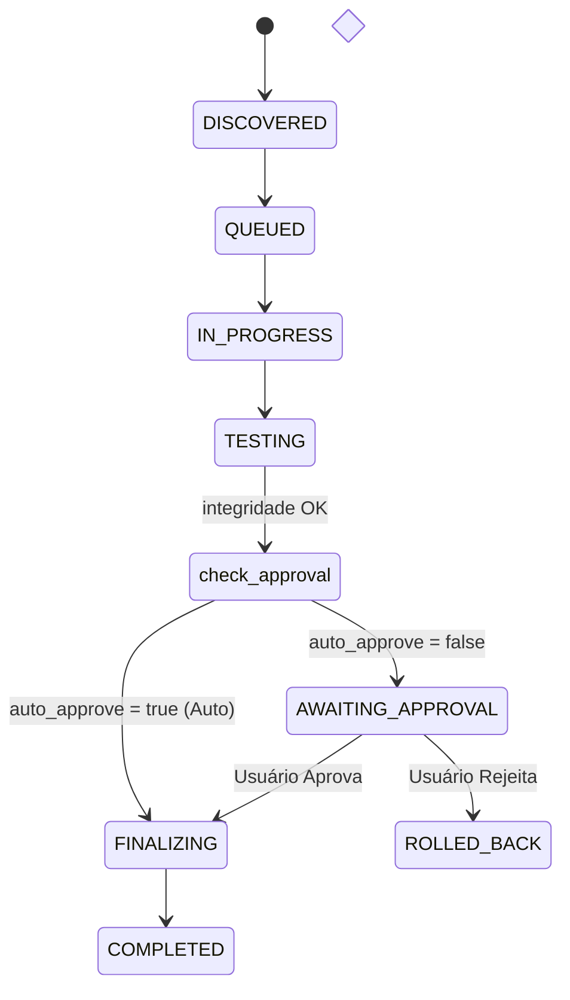

# Proposta de Implementação para a Versão 1.2: Staging e Aprovação de Transcodificação

Para a **versão 1.2** do CodecAny, propõe-se a introdução de uma **Área de Staging com Controle de Aprovação pelo Usuário**. 

Esta funcionalidade visa impedir a substituição automática e irreversível dos arquivos originais. Em vez disso, o sistema transcodifica e valida o arquivo em uma pasta temporária (staging), calcula as métricas reais de ganho de espaço e aguarda uma confirmação explícita do usuário antes de realizar o commit (substituição atômica).

---

## 📋 Resumo da Proposta

| Componente Impactado | Descrição |
| :--- | :--- |
| **Configuração (`rules.yaml`)** | Parâmetro global e por regra `auto_approve` (booleano) para ativar/desativar a aprovação manual. |
| **Estados do Engine (`types.go` & `engine.go`)** | Adição do estado `AWAITING_APPROVAL` no ciclo de vida do Job. O loop do worker pausa a substituição e mantém o arquivo no `staging_dir`. |
| **Persistência (`store.go`)** | Queries e suporte a filtros de Jobs no estado `AWAITING_APPROVAL`. |
| **Interface de Linha de Comando (`main.go`)** | Modo interativo no terminal (prompt y/N) e subcomandos administrativos para listar, aprovar ou rejeitar jobs em background. |

---

## 🔍 Detalhamento Técnico da Arquitetura

### 1. Configuração e Regras (`rules.yaml`)
Os usuários poderão habilitar ou desabilitar o comportamento de auto-aprovação de forma global ou específica por regra:

```yaml
global:
  defaults:
    auto_approve: false      # Desativa substituição automática por padrão

rules:
  - name: "MKV H264 para AV1"
    match:
      container: mkv
    convert:
      video:
        codec: av1
    auto_approve: false      # Exige aprovação para esta regra
```

---

### 2. Fluxo e Ciclo de Vida do Job (Engine)

O novo fluxo de estados integrará o estado `AWAITING_APPROVAL`:



* **Comportamento em `AWAITING_APPROVAL`**:
  - O arquivo transcodificado temporário é mantido na pasta `.codecany_tmp/` (staging).
  - O banco de dados SQLite registra o Job com as métricas de compressão (`original_size_bytes`, `converted_size_bytes`, `saved_bytes`).
  - O worker libera a CPU e passa para o próximo Job da fila.

---

### 3. Interface de Linha de Comando (CLI)

A CLI será estendida para suportar duas formas de interação:

#### A. Prompt Interativo (Modo síncrono/watch ativo)
Quando rodando diretamente no terminal, o CodecAny pode exibir um prompt de confirmação dinâmico assim que um job é finalizado:

```text
[1a418284] Staging Concluído: "The Testament of Sister New Devil.mkv"
  Tamanho Original:   1.42 GB
  Tamanho Convertido:  640.23 MB
  Espaço Economizado:  797.77 MB (56.18%)
  Codec Alvo:          AV1 (libsvtav1)
  
  Deseja substituir o arquivo original? [y/N]: _
```

#### B. Comandos de Gerenciamento da Fila (Modo assíncrono/daemon)
Para jobs rodando em segundo plano, o usuário interage via subcomandos CLI:

1. **Listar arquivos aguardando aprovação**:
   ```bash
   ./codecany -list-staged
   ```
   *Saída formatada:*
   ```text
   ID         Arquivo                     Original   Convertido   Economia
   1a418284   movie1.mkv                  1.42 GB    640 MB       56.18% (Aprovar: ./codecany -approve 1a418284)
   fe3311ab   movie2.mkv                  980 MB     810 MB       17.34% (Aprovar: ./codecany -approve fe3311ab)
   ```

2. **Aprovar e realizar a substituição**:
   ```bash
   ./codecany -approve <job-id>   # Aprova um job específico
   ./codecany -approve-all        # Aprova todos os pendentes
   ```
   *(Move o arquivo de staging para o local oficial, remove o backup `.bak` e muda o status para `COMPLETED`)*

3. **Rejeitar e descartar**:
   ```bash
   ./codecany -reject <job-id>    # Rejeita e apaga arquivo temporário
   ./codecany -reject-all         # Rejeita e limpa todos os pendentes
   ```
   *(Executa o rollback imediato, apaga os arquivos de `.codecany_tmp/` e muda o status para `ROLLED_BACK`)*

---

## ⚠️ Riscos e Mitigações do Staging

* **Risco de Acúmulo de Espaço em Disco (Staging Ocioso)**:
  - *Problema:* Se o usuário transcodificar muitos vídeos grandes e esquecer de aprová-los, a pasta `.codecany_tmp` pode encher o disco rapidamente (pois armazena o original E a cópia transcodificada ao mesmo tempo).
  - *Mitigação:*
    1. Implementar uma flag limite de espaço, ex: `-max-staged-gb 100` (pausa novos transcodes se a área de staging exceder 100 GB).
